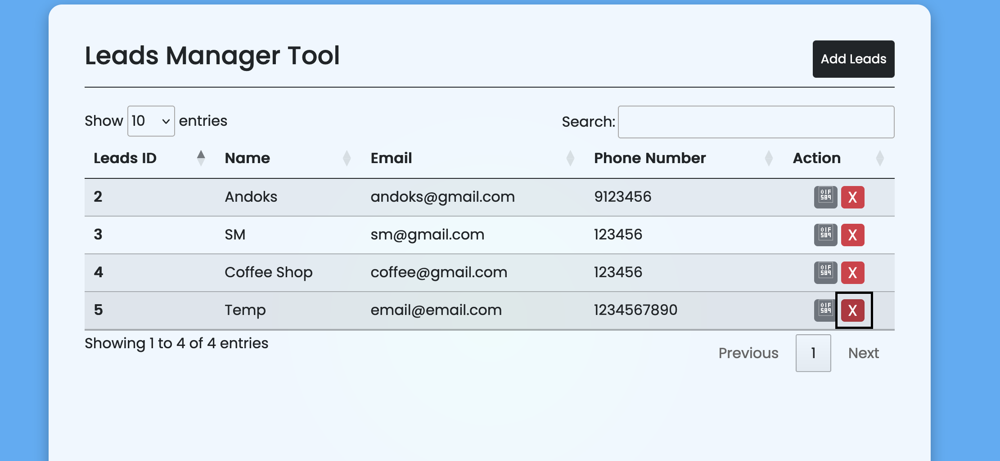

**Researcher Name:** Guru Raghav Saravanan

**Product:** Leads Manager Tool Using PHP and MySQL (SourceCodester)

**Vulnerability:** SQL Injection (SQLi)

**POC:**
An SQL injection vulnerability exists in the **leads** parameter of the delete-leads functionality within the application. This vulnerability allows an attacker to manipulate the SQL query that is executed when attempting to delete a lead record from the database.

**Attack Screenshots:**
Dashboard:

Clicking Delete Button:

Request in Burpsuite:

Sqli Payload using Ghauri:

Injecting Payload in the request:

After 5 seconds:

