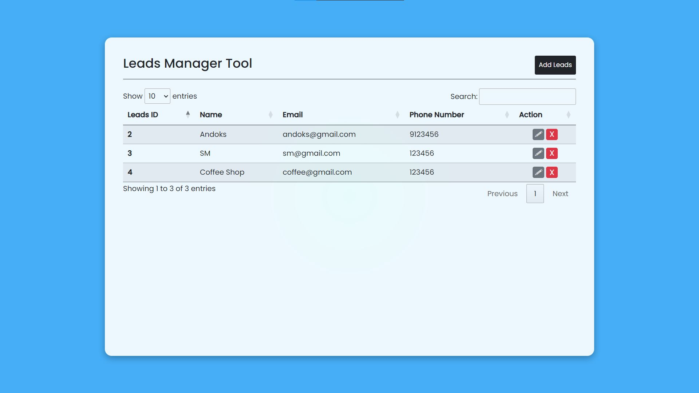
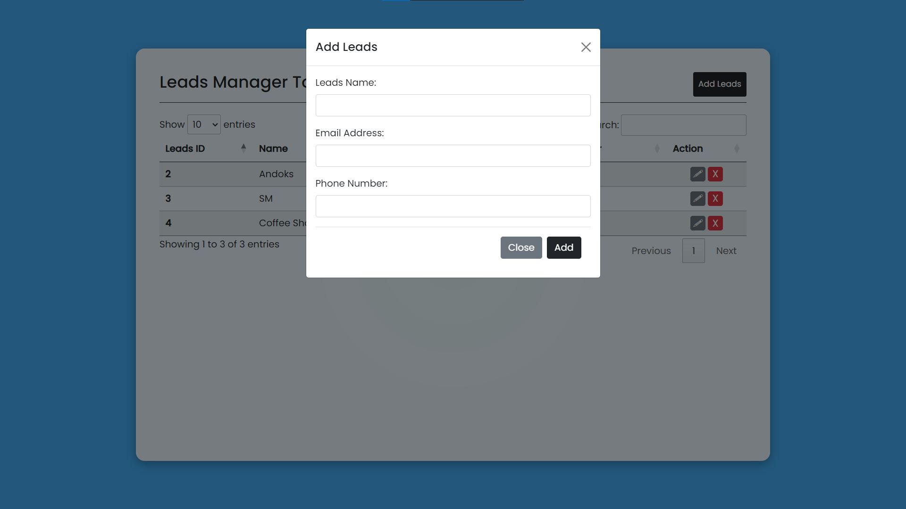
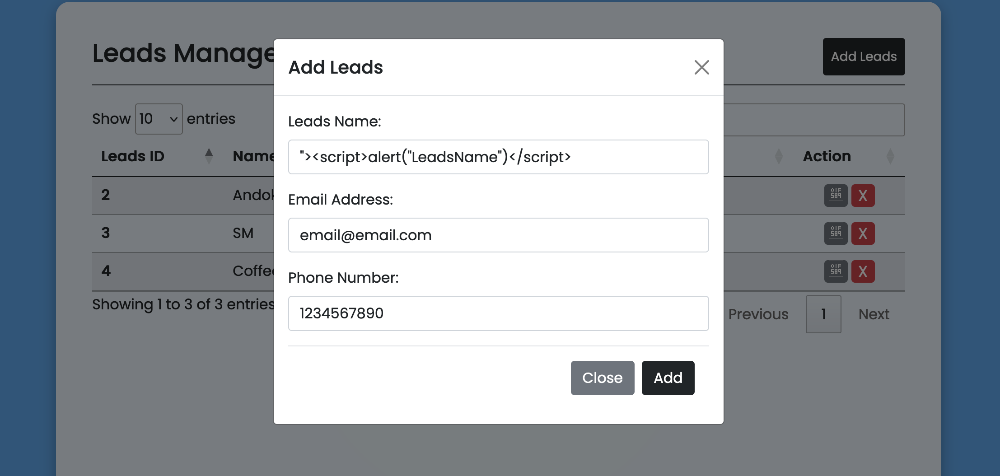
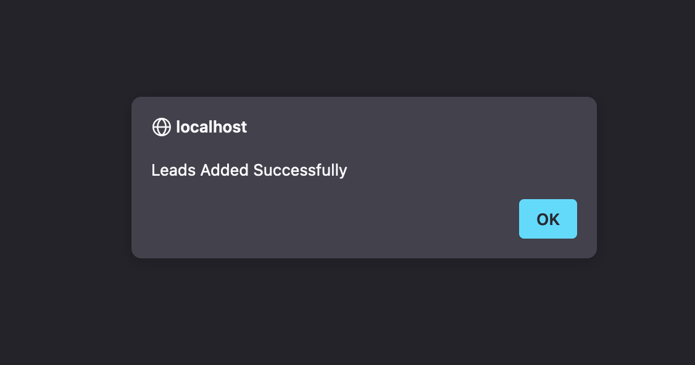
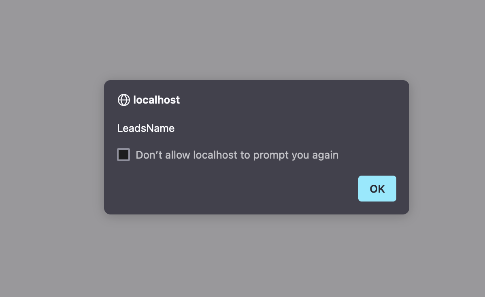
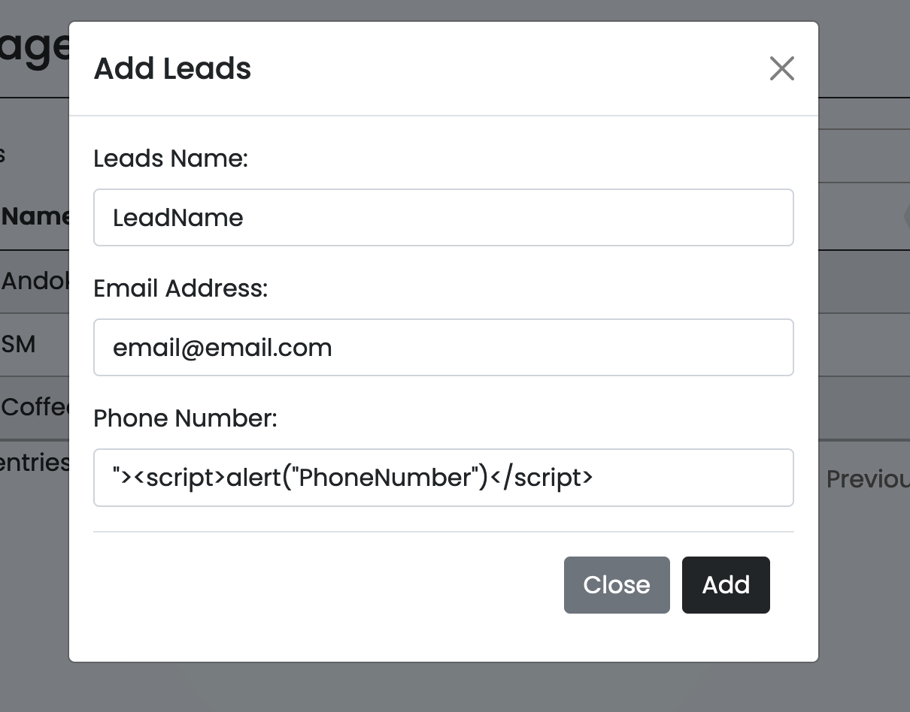
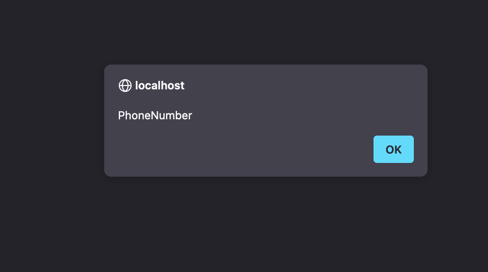

**Researcher Name:** Guru Raghav Saravanan

**Product:** Leads Manager Tool Using PHP and MySQL (SourceCodester)

**Vulnerability:** Cross Site Scripting (XSS)

**POC:**
A Cross-Site Scripting (XSS) vulnerability exists in the add-leads functionality of the application. This issue arises because the input fields for **Leads Name** and **Phone Number** do not properly sanitize user inputs, allowing attackers to inject malicious scripts.

**Attack Screenshots:**
Dashboard:

Add Lead Form:

Injecting Payload in Lead Name Field:

Payload Execution:

Injecting Payload in Phone Number Field:

Payload Execution:

